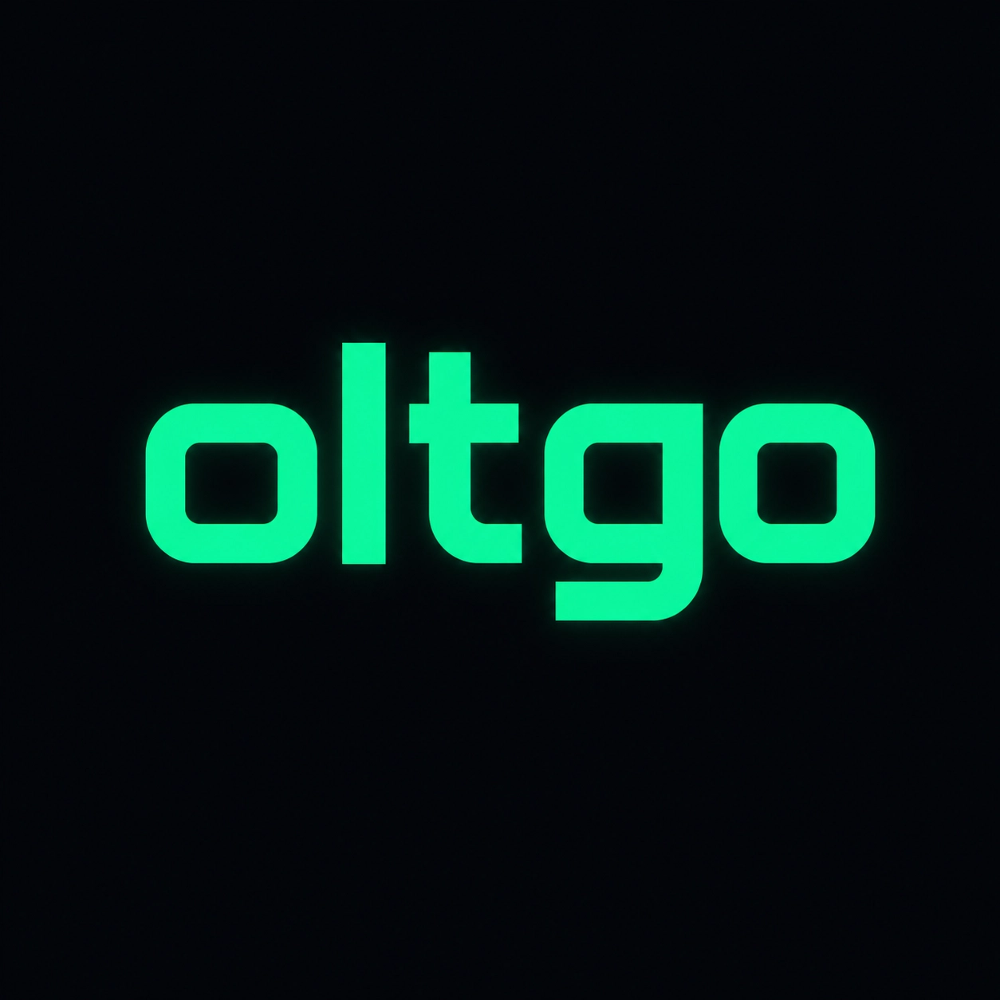

<p align="center">
  
</p>

# Oltgo — Biblioteca de Telemetria e Observabilidade em Go

O `oltgo` é uma biblioteca leve, rápida e concorrente projetada para capturar e estruturar logs e rastreamentos (traces) em microsserviços, monólitos ou quaisquer aplicações escritas em Go.

---

## 1. Arquitetura Geral

O design segue o princípio **1 Serviço -> 1 Agente**, onde cada instância da sua aplicação mantém um único `Agent` em execução.

```
+-------------------------------------------------------------+
|                     Aplicação Go                            |
|                                                             |
|   +------------------+           +----------------------+   |
|   |    Collection    | --------> |       Shipping       |   |
|   | (Fila local/Mem) |  (Canal)  | (Worker assíncrono)  |   |
|   +------------------+           +----------------------+   |
+---------------------------------------------|---------------+
                                              v
                                   [ Callback ProcessLog ]
                                   (ex: Gravar em arquivo, 
                                    enviar p/ OpenTelemetry, 
                                    Stripe, ElasticSearch, etc)
```

### Componentes Principais

1. **`Agent`**: Orquestrador central que gerencia o ciclo de vida do pipeline. É inicializado uma única vez na inicialização do serviço.
2. **`Collection`**: Estrutura *thread-safe* criada para cada transação, requisição ou trace. É responsável por acumular os dados e eventos em memória local e empacotá-los sob o schema unificado ao final da execução.
3. **`Shipping`**: Fila de buffer baseada em *Go channels*. Ela recebe as instâncias estruturadas prontas do `Collection` e consome assincronamente os dados para que a aplicação principal nunca sofra atrasos de I/O de escrita.

---

## 2. Inicializando o Agente

Para começar, inicialize o `Agent` definindo os metadados do serviço e um callback opcional de destino para os logs:

```go
package main

import (
	"encoding/json"
	"fmt"
	"github.com/joaooffzz/oltgo"
)

func main() {
	service := oltgo.Service{
		Name:    "payment-gateway",
		Version: "2.1.0",
	}

	// Callback para exportar logs estruturados (ex: saída padrão stdout)
	processLog := func(log oltgo.LogSchema) error {
		bytes, _ := json.Marshal(log)
		fmt.Println(string(bytes))
		return nil
	}

	// Inicializa
	agent := oltgo.NewAgent(service, oltgo.Production, "1", processLog)
	
	// Garante que todos os logs na fila de buffer sejam processados antes da app fechar
	defer agent.Close() 
}
```

---

## 3. Propagação de Contexto via `context.Context`

O `oltgo` utiliza o `context.Context` nativo do Go para carregar e obter a coleção de telemetria através da pilha de execução de funções (*call stack*), evitando o acoplamento excessivo de código e garantindo segurança concorrente.

### Criação e Injeção do Contexto

No início de um fluxo de requisição (por exemplo, um middleware HTTP), você cria a coleção e injeta-a no contexto:

```go
func HandleRequest(w http.ResponseWriter, r *http.Request) {
	// Cria a collection para esta chamada específica
	collection := agent.NewCollection("trace-unique-uuid")
	collection.SetRequestFromHTTP(r, oltgo.ProtoREST, 200)

	// Injeta a collection no contexto
	ctx := oltgo.WithCollection(r.Context(), collection)

	// Propaga o contexto modificado para as funções internas
	checkoutHandler(ctx)

	// Commita os dados para a fila de envio assíncrono
	collection.Commit()
}
```

### Extração e Registro de Eventos na Pilha

Em qualquer sub-função que receba o contexto, você pode extrair a `Collection` com segurança e registrar eventos:

```go
func executeBusinessLogic(ctx context.Context) {
	// Recupera a coleção. Se não estiver no contexto, retorna nil com segurança
	collection := oltgo.FromContext(ctx)
	if collection == nil {
		return
	}

	// Inicia um evento com cálculo de tempo automático
	event := collection.StartEvent("db_query", oltgo.TypeDatabase, oltgo.SeverityInfo)
	event.WithMessage("Selecionando itens do carrinho")
	
	defer event.End() // Ao finalizar a função, calcula a duração e salva o evento

	// Executa operação de fato...
	if err := queryDB(); err != nil {
		event.AddError("DB_ERROR", err.Error(), nil)
	}
}
```

---

## 4. Eventos Hierárquicos (Árvore de Eventos)

O `oltgo` suporta o aninhamento automático de eventos em uma estrutura de árvore. Ao usar a função `oltgo.StartEvent(ctx, ...)`, o ID do evento pai é propagado automaticamente pelo `context.Context`, eliminando a necessidade de vincular manualmente o `parent_event_id`.

### Como funciona

1. `oltgo.StartEvent` retorna um **novo contexto** contendo o ID do evento recém-criado como "evento ativo".
2. Qualquer chamada subsequente a `oltgo.StartEvent` usando esse contexto herdará automaticamente o evento anterior como pai.
3. No `Commit()`, a lista plana de eventos é reconstruída em uma árvore hierárquica baseada nos `parent_event_id`.

### Exemplo Prático

```go
func checkoutHandler(ctx context.Context) error {
	// Evento raiz — todos os subeventos serão filhos dele
	ctx, mainEvt := oltgo.StartEvent(ctx, "checkout_flow", oltgo.TypeFunction, oltgo.SeverityInfo)
	defer mainEvt.WithMessage("Fluxo de checkout completo").End()

	// Subeventos herdam o pai automaticamente do contexto
	authenticateUser(ctx)
	fetchItems(ctx)

	return nil
}

func authenticateUser(ctx context.Context) {
	// Automaticamente filho de "checkout_flow"
	_, evt := oltgo.StartEvent(ctx, "authenticate_user", oltgo.TypeFunction, oltgo.SeverityInfo)
	defer evt.WithMessage("Usuário autenticado com JWT").End()
}

func fetchItems(ctx context.Context) {
	// Automaticamente filho de "checkout_flow"
	ctx, evt := oltgo.StartEvent(ctx, "fetch_items", oltgo.TypeDatabase, oltgo.SeverityInfo)
	defer evt.WithMessage("Itens carregados").End()

	// Netos: filhos de "fetch_items"
	checkStock(ctx)
}

func checkStock(ctx context.Context) {
	// Automaticamente filho de "fetch_items"
	_, evt := oltgo.StartEvent(ctx, "check_stock", oltgo.TypeDatabase, oltgo.SeverityInfo)
	defer evt.WithMessage("Estoque verificado").End()
}
```

### Saída JSON Resultante

O `Commit()` produz uma árvore aninhada automaticamente:

```json
{
  "events": [
    {
      "event_id": "evt_001",
      "name": "checkout_flow",
      "events": [
        {
          "event_id": "evt_002",
          "parent_event_id": "evt_001",
          "name": "authenticate_user"
        },
        {
          "event_id": "evt_003",
          "parent_event_id": "evt_001",
          "name": "fetch_items",
          "events": [
            {
              "event_id": "evt_004",
              "parent_event_id": "evt_003",
              "name": "check_stock"
            }
          ]
        }
      ]
    }
  ]
}
```

### Funções Auxiliares de Contexto

| Função | Descrição |
|---|---|
| `oltgo.StartEvent(ctx, name, type, severity)` | Cria um evento, herda o pai do contexto e retorna `(newCtx, *EventBuilder)` |
| `oltgo.WithActiveEvent(ctx, eventID)` | Associa manualmente um ID de evento ao contexto |
| `oltgo.ActiveEventFromContext(ctx)` | Recupera o ID do evento ativo do contexto |

> **Nota:** A API antiga `collection.StartEvent(...)` continua funcionando para casos onde o aninhamento não é necessário. Eventos criados por ela não terão `parent_event_id` e aparecerão como raízes.

---

## 5. Logs sem Requisição (Inicialização, Jobs e Workers)

O campo `request` do schema é **opcional**. Nem todo trace nasce de uma requisição HTTP/gRPC: a inicialização do serviço, migrações, jobs agendados, consumidores de fila e CLIs também merecem observabilidade.

Para esses casos basta **não chamar** `SetRequest` / `SetRequestFromHTTP`. O campo `request` (e também `actor`, se não definido) é omitido do JSON final — não é enviado como `null`.

```go
func bootstrap(agent *oltgo.Agent) error {
	// Trace de inicialização: nenhum SetRequest é necessário
	col := agent.NewCollection("trace_startup_" + version)
	ctx := oltgo.WithCollection(context.Background(), col)
	defer col.Commit()

	ctx, bootEvt := oltgo.StartEvent(ctx, "bootstrap", oltgo.TypeFunction, oltgo.SeverityInfo)
	defer bootEvt.WithMessage("Serviço inicializado").End()

	// Subevento: conexão com o banco
	_, dbEvt := oltgo.StartEvent(ctx, "connect_database", oltgo.TypeDatabase, oltgo.SeverityInfo)
	if err := db.Ping(); err != nil {
		dbEvt.AddError("DB_UNREACHABLE", err.Error(), nil)
		dbEvt.End()
		return err
	}
	dbEvt.WithMessage("Pool de conexões estabelecido").
		WithMetadata(map[string]any{"driver": "postgres", "max_open_conns": 25}).
		End()

	return nil
}
```

JSON resultante (sem `request` e sem `actor`):

```json
{
  "tracing_id": "trace_startup_1.0.0",
  "status": "SUCCESS",
  "environment": "production",
  "schema_version": "1",
  "service": { "name": "order-api", "version": "1.0.0" },
  "time": { "duration_ms": 412, "created_at": "...", "finished_at": "..." },
  "events": [
    {
      "event_id": "evt_001",
      "name": "bootstrap",
      "events": [{ "event_id": "evt_002", "parent_event_id": "evt_001", "name": "connect_database" }]
    }
  ]
}
```

### Regras de comportamento

| Situação | Resultado |
|---|---|
| `SetRequest` nunca chamado | `request` omitido do JSON |
| `SetRequest(nil)` | Limpa uma requisição definida anteriormente; `request` volta a ser omitido |
| `SetRequestFromHTTP(nil, ...)` | Chamada ignorada com segurança (sem panic); `request` permanece omitido |
| `status` geral do trace | Derivado apenas dos eventos quando não há `request`; um evento `FAILURE` marca o trace como `FAILURE` |

---

## 6. O Schema de Log Estruturado

Todos os logs commitados são unificados sob uma estrutura padrão e enviados para o callback `ProcessLog`. A documentação completa dos campos do schema JSON pode ser vista em:
- [Documentação de Campos (docs/log.md)](docs/log.md)
